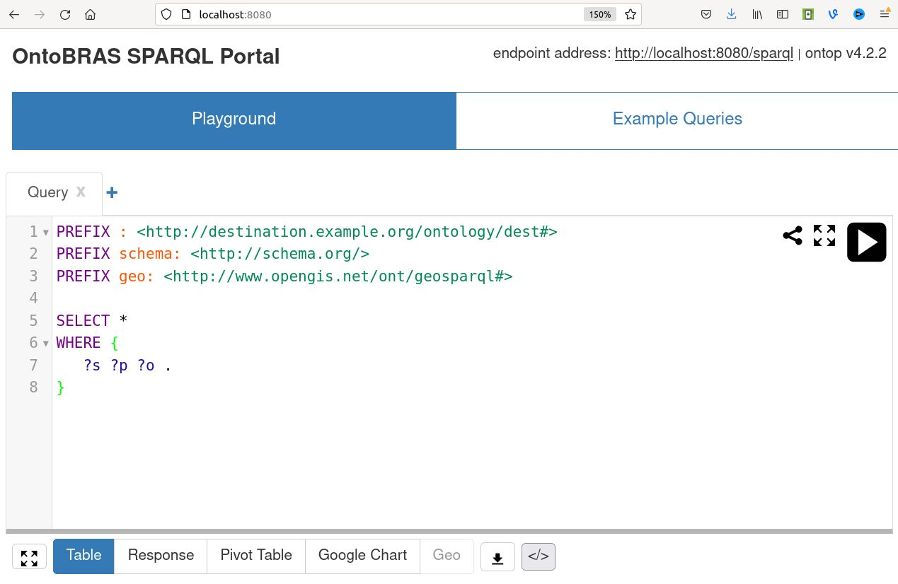
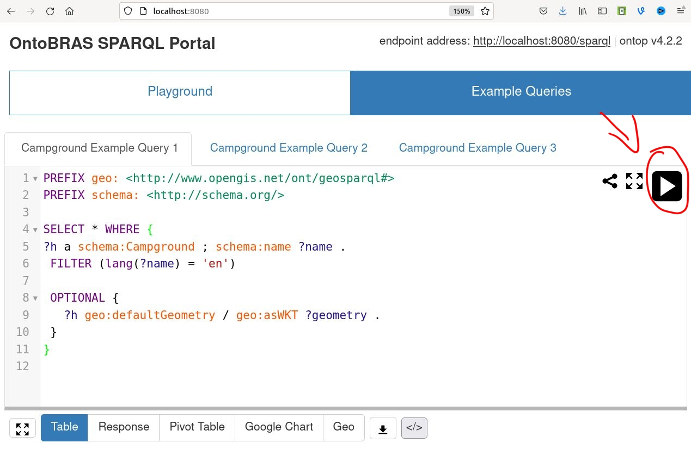
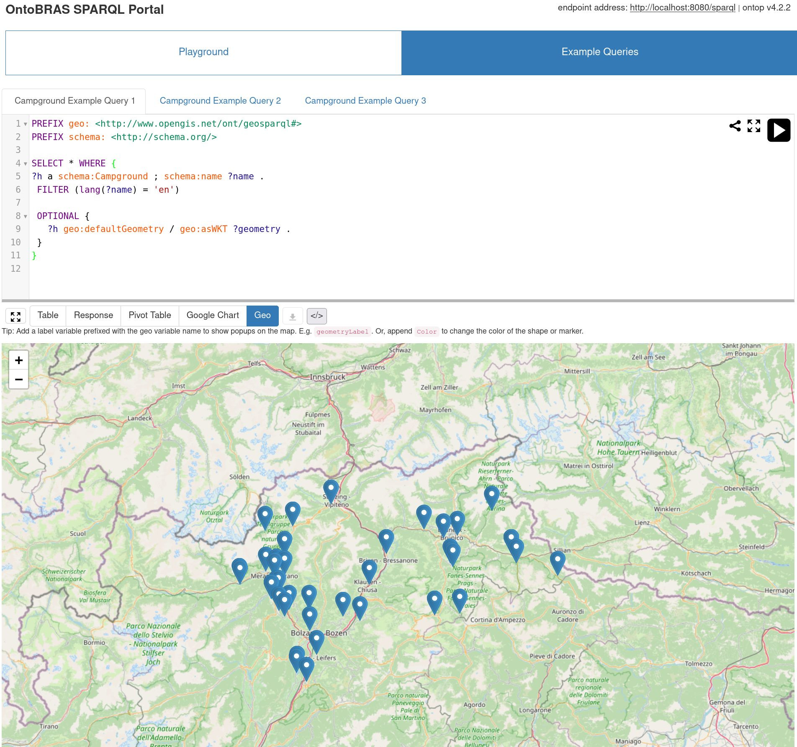

# Deploying a SPARQL Endpoint through Ontop

In this tutorial we will look at how to deploy a SPARQL endpoint through Ontop. A SPARQL endpoint is an HTTP endpoint compliant to the [SPARQL HTTP protocol](https://www.w3.org/TR/sparql11-protocol/), that can be used to execute queries against the VKG.

In Ontop, there are two ways of deploying a SPARQL endpoint:

- Trough [command line interface](https://ontop-vkg.org/guide/cli.html#setup-ontop-cli), or
- Trough [docker image](https://ontop-vkg.org/tutorial/endpoint/endpoint-docker.html).

In this tutorial we will focus on the first method, but you can experiment yourselves with the second by following the instructions contained in the provided [link](https://ontop-vkg.org/tutorial/endpoint/endpoint-docker.html).

## Prerequisites

For this tutorial, you need a working java installation. If your machine does not have java installed, please [download and install it](https://www.java.com/en/download/manual.jsp).

## Ontop Command Line Interface (CLI)

Ontop ships a shell script (`ontop` for *nix) and a bat file (`ontop.bat` for Windows) exposing the core functionality and several utilities. The CLI is an easy way to get the system quickly set-up, test for correct execution, and query or materialize VKG graphs as needed. The commands available through the CLI are the following:

```shell
$ ./ontop help
usage: ontop <command> [ <args> ]

Commands are:
    --version             Show version of ontop
    bootstrap             Bootstrap ontology and mapping from the database
    endpoint              Start a SPARQL endpoint powered by Ontop
    extract-db-metadata   Extract the DB metadata and serialize it into an output JSON file
    help                  Display help information
    materialize           Materialize the RDF graph exposed by the mapping and the OWL ontology
    query                 Query the RDF graph exposed by the mapping and the OWL ontology
    validate              Validate Ontology and Mappings
    mapping               Manipulate mapping files
```

In this tutorial we focus on the `ontop endpoint` command, orchestrating the deployment of a SPARQL endpoint.

## Setup Ontop CLI

    First, you have to download the latest Ontop CLI zip from our download pages ([Github](https://github.com/ontop/ontop/releases) or [Sourceforge](https://sourceforge.net/projects/ontop4obda/files/)). Unzip its content in the `deployment` folder. Open the command line terminal and `cd` to that folder. For Windows use the `ontop.bat` file, for Linux and OS X use the `ontop` file. To check whether everything works fine, try running the `help` command:

```shell
deployment/$ ./ontop help
usage: ontop <command> [ <args> ]

Commands are:
    --version             Show version of ontop
    bootstrap             Bootstrap ontology and mapping from the database
    endpoint              Start a SPARQL endpoint powered by Ontop
    extract-db-metadata   Extract the DB metadata and serialize it into an output JSON file
    help                  Display help information
    materialize           Materialize the RDF graph exposed by the mapping and the OWL ontology
    query                 Query the RDF graph exposed by the mapping and the OWL ontology
    validate              Validate Ontology and Mappings
    mapping               Manipulate mapping files
```

## JDBC configuration

JDBC drivers are software implemented by third parties (often the same developers of the database system) that handle the interaction with the database in their own proprietary protocols. In a typical deployment of Ontop, you will need to manually download the JDBC drivers for your database management system, and put them into the `deployment/jdbc` directory. For PostgreSQL and this tutorial, you don't need to download the driver, as it can be simply copied from the `jdbc` folder in the root directory of the project, e.g.:

```shell
deployment/$ cp ../jdbc/postgresql-42.2.8.jar jdbc/
```
## Property file

Most commands below require or accept as input a property file. This is where you will specify the JDBC connection parameters, as well as other Ontop-related [advanced parameters](https://ontop-vkg.org/guide/advanced/configuration.html). For this tutorial, connection parameters will be provided through property file `deployment/connection/connection.properties`, which has the following content:

```
jdbc.url=jdbc\:postgresql\://ontobras1.cw6ltdje1jrb.eu-west-3.rds.amazonaws.com/postgres
jdbc.driver=org.postgresql.Driver
jdbc.user=ontobras
jdbc.password=ontoptutorial
ontop.queryOntologyAnnotation=true
ontop.enableFactExtractionWithTBox=true
```

The first four lines specify the connection parameters to the database. The last two lines are additional (and, optional) Ontop-related [advanced parameters](https://ontop-vkg.org/guide/advanced/configuration.html):

- `ontop.queryOntologyAnnotation=true`: this option enables queries over [OWL Annotation Properties](https://www.w3.org/TR/owl-ref/#Header);
- `ontop.enableFactExtractionWithTBox=true`: this option allows to pose queries over the ontology structure.

## Deploying the Endpoint

`ontop endpoint` deploys a SPARQL endpoint locally at the address `/sparql`, and by default on the port `8080`. To start the endpoint with the ontology, mappings, and lenses you have produced with Ontopic Studio, you can simply run the following command from within the `deployment` folder:

```shell
deployment/$ ./ontop endpoint -t ../vkg/ontology.ttl \
                              -m  ../vkg/mapping.ttl \
                              -p connection/connection.properties \
                              -v ../vkg/lenses.json \
                              --portal=connection/predefined-queries.toml
```
The command is self-explanatory, apart from the last (optional) argument `--portal`, which we will explain in a minute. If everything went fine, the endpoint should be up and listening for requests at the address `http://localhost:8080/sparql`. At this point, you should be able to send `POST` or `GET` requests carrying the SPARQL query to evaluate (as per [SPARQL HTTP protocol](https://www.w3.org/TR/sparql11-protocol/)).

For instance, consider the first "campground query" you wrote in the modeling part of this tutorial:

```sparql
PREFIX geo: <http://www.opengis.net/ont/geosparql#>
PREFIX schema: <http://schema.org/>

SELECT * WHERE {
?h a schema:Campground ; schema:name ?name .
 FILTER (lang(?name) = 'en')

 OPTIONAL {
   ?h geo:defaultGeometry / geo:asWKT ?geometry .
 }
}
```

This query can be evaluated against our SPARQL endpoint through an HTTP request, for instance by using [curl](https://curl.se/):

```shell
$ curl --request POST \
     --url http://localhost:8080/sparql \
     --header "accept: application/json" \
     --header "content-type: application/sparql-query" \
     --data "PREFIX geo: <http://www.opengis.net/ont/geosparql#> PREFIX schema: <http://schema.org/> SELECT * WHERE {?h a schema:Campground ; schema:name ?name . FILTER (lang(?name) = 'en') OPTIONAL {?h geo:defaultGeometry / geo:asWKT ?geometry .}}"
```

Running the command above (assuming you have `curl` installed), will return the following JSON answer:

```json
{
  "head" : {
    "vars" : [
      "h",
      "name",
      "geometry"
    ]
  },
  "results" : {
    "bindings" : [
      {
        "h" : {
          "type" : "uri",
          "value" : "http://mydata.example.org/source2-hotels/2CDD759082854DA155AB3FE9B5DEC46C"
        },
        "name" : {
          "xml:lang" : "en",
          "type" : "literal",
          "value" : "Stadtcamping Glorenza/Glurns"
        }
      },
      {
        "h" : {
          "type" : "uri",
          "value" : "http://mydata.example.org/source2-hotels/724FDB8ACFC811D1BA6B444553540000"
        },
        "name" : {
          "xml:lang" : "en",
          "type" : "literal",
          "value" : "Camping Trafoi"
        }
      },
      {
        "h" : {
        ...
```

Alternatively, you can exploit one of the the many [SPARQL client libraries](https://www.w3.org/wiki/SparqlImplementations) available for many programming and data analysis environments, such as [rdf4j](https://rdf4j.org/documentation/tutorials/getting-started/) for Java. In this tutorial we won't explore these options, but you are invited to try out for yourselves!

Other than the HTTP endpoint, `ontop endpoint` provides an web portal that can be used to query the system. The portal is located under `http://localhost:8080`:



Under `Example Queries` tab, you can select and execute any of the three queries you wrote in the modeling part of this tutorial. How come? You actually provided them as a parameter when you launched the endpoint, through the `--portal=connection/predefined-queries.toml` argument. The queries file `predefined-queries.toml` has the following content:

```
title="OntoBRAS SPARQL Portal"

[[tabGroups]]

name="Example Queries"

[[tabGroups.tabs]]

name="Campground Example Query 1"
query="""
PREFIX geo: <http://www.opengis.net/ont/geosparql#>
PREFIX schema: <http://schema.org/>

SELECT * WHERE {
?h a schema:Campground ; schema:name ?name .
 FILTER (lang(?name) = 'en')

 OPTIONAL {
   ?h geo:defaultGeometry / geo:asWKT ?geometry .
 }
}
"""

[[tabGroups.tabs]]

name="Campground Example Query 2"
query="""
PREFIX geo: <http://www.opengis.net/ont/geosparql#>
PREFIX schema: <http://schema.org/>
PREFIX voc: <http://tutorial.example.org/voc#>

SELECT * WHERE {
  ?h a schema:Campground ; schema:name ?name ; schema:containedInPlace ?municipality .

  ?municipality a voc:Municipality ; schema:name ?municipalityName .

  FILTER (lang(?name) = 'en' && lang(?municipalityName) = 'en')

  OPTIONAL {
    ?h geo:defaultGeometry / geo:asWKT ?geometry .
  }
}
"""

...
```

Below the query box, you have different possible options for the visualizations of your results. For instance, try running `Campground Example Query 1` (by clicking on the "play like" button on the top left of the query box).



After a short wait, you will get results returned in tabular form. Since our results contain Geospatial information, they can be conveniently displayed on a map by clicking on the `Geo` button at the bottom right of the interface:



`ontop endpoint` offers lots of advanced options for deploying SPARQL endpoints. The full list of options is available through the `ontop help` command:

```shell
deployment$ ./ontop help endpoint
```

# Write SPARQL Queries

Now that we have a running SPARQL endpoint, let's write some SPARQL queries and evaluate them against it! You can take inspiration from the three queries under the `Example Queries` tab, and evaluate your creations under the `Playground` tab. For formulating the queries below, I suggest referring to the ontology diagram at the end of the [README.md](../README.md) file.

1. Retrieve all lodging businesses, their name in English, their positions (if available), and the administrative area they are contained in.
2. Let's try to query the annotations contained in the ontology. Specifically, retrieve the `rdfs:comment` annotation relative to class `LodgingBusiness` (requires `ontop.queryOntologyAnnotation=true` option). For the `rdfs` prefix, use `http://www.w3.org/2000/01/rdf-schema#`.
3. Now, what about querying the ontology structure? Try writing a SPARQL query retrieving all kinds of lodging businesses (i.e., campgrounds, hotels, etc.). **Hint:** use the `rdfs:subClassOf` property, encoding the ISA relation between classes.
4. Retrieve the names of campgrounds that **do not** have a geospatial coordinate in our data. **Hint:** Have a look at the [BOUND](https://www.w3.org/TR/rdf-sparql-query/#func-bound) SPARQL function (and, negation!).
5. Retrieve the number of hotels in our data. **Hint:** use the [COUNT](https://www.w3.org/TR/sparql11-query/#aggregates) aggregation function.
6. Retrieve the names of the 10 municipalities containing the highest number of hotels, together with the number of hotels they contain. Such list should be ordered by number of hotels (descending order).
7. Out of the "top 10 municipalities" from the query above, how many do not have an associated geospatial coordinate in our data? Retrieve such number. **Hint:** Use [SPARQL subqueries](https://www.w3.org/TR/sparql11-query/#subqueries).
8. Retrieve the number of instances in each subclass of lodging business.
9. Out of the subclasses of lodging businesses, what are those _having_ less than 3000 instances?
10. On a map, show the locations of lodging businesses in the municipality of `"Merano/Meran"@en`, their names, and in such a way that each kind of lodging business is associated to a different color (e.g., green for campgrounds and blue for hotels). **Hint:** use special variables `?posLabel` and `?posColor` to specify respectively the labels and the colors to be displayed on the map. Specific colors can be bound to specific lodging businesses by using the `BIND` function, e.g., `BIND("chlorophyll,0.5" AS ?posColor)`. For specifying the actual colors, other than `chlorophyll` you can use `viridis` and `jet`.

## More Queries?

The `vkg/complete/` folder contains a complete VKG setting for the lodging scenario. Try loading it, and play with the queries provided in the `.toml` file!
