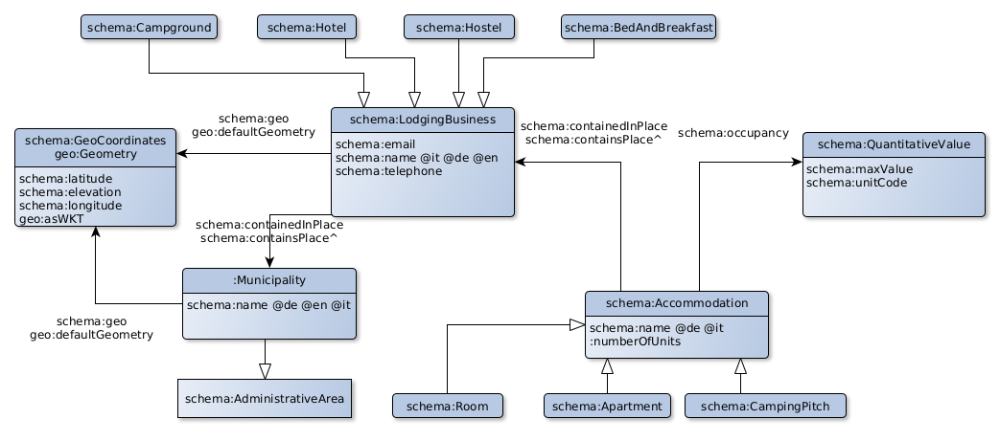

# Modelling

In this tutorial, the ontology is already provided. We will focus on the mapping and the lenses. Our goal is to reproduce a fragment of the following diagram (the rest will be given as an exercice).



## Preparation

1. Go to your instance of Ontopic Studio.
2. Create a project `dest-USERNAME` by replacing `USERNAME` by your user name and using the sample DB.
3. Open the project
4. Go to the `Lenses` page. You see there, on the left, the list of database tables and views.


## Ontology
 1. Go to the `Ontology` page
 2. Download and unzip [the archive containing the ontology files](https://github.com/ontopic-vkg/destination-tutorial-ontopic-studio/raw/main/ontologies/ontologies.zip) (available in the `ontologies` directory).
 2. Import the file `schema.owl`
 3. Import the file `geosparql.owl`


## Lodging businesses in source 1

### Lens

 1. Go to the `Lenses` page
 2. Among the `Source Tables` (on the left), select the schema `source1` to filter the tables
 3. Select the table `source1.hospitality` and click on `Generate mirror lens`
 4. Click on `lenses.source1.hospitality` on the right to open the newly created lens.
 5. Click on `Constraints` and observe that a unique constraint is defined on the `h_id` column, as well as foreign key on the `m_id` column.
 6. The column `geometrypoint` is in a binary format and needs to be converted into the [Well-Known Text format](https://en.wikipedia.org/wiki/Well-known_text_representation_of_geometry). Click on the menu of the column `geometrypoint` and click on `Edit`.
 7. At the bottom, select the transformation `Geo To Well-Known Text` and click on the button `+`. Click on `Preview` to preview the results. Then, click on `Update column`.

### Mapping

#### First class mapping entry
 1. Go to the `Mapping` page and click on the lens `lenses.source1.hospitality`.
 2. Let's map all the rows to a class. Click on the button `C+` for creating a mapping entry.
 3. We need first to specify the subject as a template. Make sure the option `Template` is selected. Open the template menu and click on `Create new template`. Ontopic Studio automatically proposes the template `data:source1-hospitality/{h_id}` out of the lens name and the unique constraint on the column `h_id`. Accept it by clicking on `Create`.
 4. Let's now assign a class. Make sure `Constant` is selected for the class. In the drop-down menu below select the class `schema:LodgingBusiness`. Click and save and you are having your first mapping entry!

#### First data property mapping entry
 5. Let's now map the name in English to the lodging business. Let's create a property mapping entry for the same subject by clicking on the button `P+` on the right of the IRI template `data:source1-hospitality/{h_id}`.
 6. You should see that subject section is already filled with the same values as before. If it is not the case, you probably clicked on the other `P+` button at the top of the page. In that case, go back and click on the correct `P+` button.
 7. Select the property `schema:name` in the property drop-down menu.
 8. For the object, we want to direct map the value from the column `name_en`. Select `Literal` and the type `Column` and then the `name_en` in the column drop-down menu. 
 9. Notice that the datatype field get automatically filled after selecting the column as `xsd:string`. This is because the column type is `text` and, according to [R2RML](https://www.w3.org/TR/r2rml/#natural-mapping) character string types are mapped to that RDF datatype. However here we want to assign a language tag (en), so as to distinguish from the names in German and Italian. Select the value `@en` in the Datatype/Language drop-down menu and save the mapping entry.

#### First object property mapping entry
 10. Let's now map the default geometry of the lodging business. As previously, click on the button `P+` on the right of the IRI template `data:source1-hospitality/{h_id}`.
 11. Select the property `geo:defaultGeometry`.
 12. For object, you can see that the pre-selected kind value is not `Literal` as before but `IRI/BNode`. This is because the property `geo:defaultGeometry` is declared in the ontology as an object property, so it expects an IRI or a BNode as value. The type `Template` is also pre-selected because it is the most common mechanism for building an IRI as object. Let's keep it.
 13. We need to provide an IRI template for geometry objects. Here we have no plan to share the same geometries between lodging businesses, so let's create one geometry object per lodging business, using the unique constraint of the lens (`h_id`). In the template drop-down menu, click on  `Create new template`. This time we need to modify the default value suggested by the platform. Replace the text entry `data:source1-hospitality/` by `data:geo/source1-hospitality/` and click on `Create`. Save the mapping entry.

#### Geometry literal

 14. Let's now map the geometry value to the new IRI template. Since the subject is not the same as in the previous mapping entries, click on the `P+` button at the top the page.
 15. For the subject, select the template `data:geo/source1-hospitality/{h_id}`.
 16. For the property, select `geo:asWKT`.
 17. For the object, keep `Literal` as kind and select the column `geometrypoint`. For its datatype, select `geo:wktLiteral`. Save the mapping entry.


 #### Sub-classes of lodging businesses

 18. We now want to map to sub-classes of `schema:LodgingBusiness` depending on the values found in the column `h_type`. Let's create a new mapping entry. Click on `C+` on the right of the template `data:source1-hospitality/{h_id}`.
 19. For the class, we don't want to assign the same value to each lodging business found in the lens, so we cannot select the type `Constant`. Select instead the type `Dictionary`.
 20. For the column, select `h_type`.
 21. Let's now fill the first line of the dictionary. On the left field, insert the string `Camping` as found in the `h_type` column of the lens. In the right field, select the class `schema:Campground`. Everytime the value `Camping` is found in the column `h_type`, the lodging business will be declared instance of the class `schema:Campground`.
 22. Click on `+` for adding a new line. Map this time the value `HotelPension` to the class `schema:Hotel`.
 23. Map the value `BedBreakfast` to `schema:BedAndBreakfast`. Save the mapping entry.


We have produced enough mapping entries for this lens for the moment. We leave the rest as a homework exercise. Please refer to the VKG diagram to see which properties are missing.

### Snapshot and mapping export

 1. Go on the `Dashboard` page and click on `Snapshot`. Technically speaking, it will create a Git commit with all the important files of the project.
 2. Open the `Repository` page to see the following snapshotted/committed files:
     - `lenses.json`: definition of the lenses in the Ontop format.
     - `mapping.ttl`: R2RML mapping file defined over the lenses.
     - `ontology.ttl`: RDFS/OWL2QL ontology serialized in Turtle.
     - `YOUR_PROJECT.ontopicprj`: internal representation of your project. Can be imported in Ontopic Studio to override the mapping, lenses and the ontology.
 3. Go back to the Ontopic Studio tab. Go the `Mapping page`. Click on `Export mapping` and then on `Without lenses` to download the mapping in R2RML that directly refers to tables in the source instead of the lenses. This file is interoperable with any R2RML processor.

### Test

Let's test our mapping by deploying Ontop directly in Ontopic Studio and issue our first SPARQL query.

 1. Go to the `Query` page. Click on `Start` at the top right.
 2. Execute the following SPARQL query:
 ```sparql
PREFIX geo: <http://www.opengis.net/ont/geosparql#>
PREFIX schema: <http://schema.org/>

SELECT * WHERE {
 ?h a schema:Campground ; schema:name ?name .
  FILTER (lang(?name) = 'en')
  
  OPTIONAL {
    ?h geo:defaultGeometry / geo:asWKT ?geometry .
  }
} 
 ```
3. Click on `View SQL` to see the generated SQL query.


## Lodging businesses in source 2

1. Go to the `Lenses` page and create a mirror lens for the table `source2.hotels`. Open the newly created lens.
2. We can see it has similar kind of information but with a different column names and special values. Let's keep the lens as it is for the moment and start mapping it. For that, click at bottom right on `0 mapping entries` to reach the mapping editing page for this lens.
3. Create a class mapping entry with a new IRI template to map all the rows of the lens to the class `schema:LodgingBusiness`.
4. Map the name in English of the lodging businesses.
5. Map the following values of the column `htype`:
    - 1 to `schema:BedAndBreakfast`
    - 2 to `schema:Hotel`
    - 4 to `schema:Campground`.
6. Snapshot the changes.
7. Go to the `Query` page and update the SPARQL endpoint.
8. Run the previous SPARQL and observe that it now returns more results. If you look at SQL query, you will see that is now contains a UNION.


## Municipalities

 1. Create a mirror lens from the table `source1.municipalities`. Open the newly created lens.
 2. Click on `Constraints` and observe that this lens contains 2 unique constraints: one on `m_id`, one on `istat`. The first column is an internal identifier that is specific to `source1`. The second column is the official code of the municipality assigned by the Italian Institute of Statistics (Istat).
 3. Go to the page about the lens `lenses.source1.hospitality` and notice it has a column `m_id` referring to the internal code of the municipality.
 4. Go to the page about the lens `lenses.source2.hotels` and observe it has a column `mun` referring to the Istat code.
 5. As we would to use the same municipality identifiers for the lodging businesses from the 2 sources, let's use the Istat code for in the IRI template of municipalities and not the internal one.
 6. Go to the mapping page of the lens `lenses.source1.municipalities`. Click on `C+` for creating a class mapping entry.
 7. Click on `Create IRI template`. By default Ontopic Studio generates a template using the first unique constraint (`m_id`). Replace the binding value `m_id` by `istat`. Create the template.
 8. schema.org does have the class for municipalities so let's create one. In the class drop-down menu, click on `Create new class`. Insert `Municipality` as class name and select `schema:AdministrativeArea` as parent. Click on `Create`. Save the mapping entry.
 9. Map the English name of the municipality.
 10. Snapshot the changes.


### Prefix update

 1. Go to the `Dashboard` page. Click on `Manage project prefixes`.
 2. Change the value associated to `voc` to `http://tutorial.example.org/voc#`. Click on `Save` and reply `Yes` to the question. We now changed the IRI of `voc:Municipality`.
 3. Snapshot the changes.


## Linking lodging businesses to municipalities

### Source 1

For creating a mapping entry linking lodging businesses from source 1 to their municipality, we need to obtain their local identifier columns (respectively `h_id` and `istat`) in the same lens. The lenses `lenses.source1.hospitality` and `lenses.source1.municipalities` only contain one of the two. Therefore we need to create a join lens to obtain the two columns at the same time.

 1. Go the `Lenses` page. On the left, select the tables `source1.hospitality` and `source1.municipalities` and click on `Create join lens`. Insert the name `source1.hospitality-municipalities-join`. 
 2. For `source1.hospitality`, provide the prefix `h_` and for `source1.municipalities` the prefix `m_`. All the columns coming from the first table will prefixed by `h_` while the ones from the second table by `m_`.
 3. Add an equality between `h_m_id` and `m_m_id`. Click on `Create join lens`.
 4. Open `lenses.source1.hospitality-municipalities-join` and click on `0 mapping entries`.
 5. Click on `P+` to create a property mapping entry.
 6. Select `data:source1-hospitality/{h_id}` as template for the subject. For the binding of the placeholder `h_id` in the template, select the column `h_h_id` (it could not be pre-selected because there is no column `h_id` in this lens).
 7. Select the property `schema:containedInPlace`.
 8. Select `IRI/BNode` for the object, `data:source1-municipalities/{istat}` as template and the column `m_istat` as binding for the placeholder `istat`. Save the mapping entry.

### Source 2
 
 1. Go the mapping page of the lens `lenses.source2.hotels`.
 2. Observe that the `mun` column  has an integer datatype. However in `lenses.source1.municipalities`, the `istat` column is a string and starts with the character `0`. So here we have to be careful in creating IRIs for the municipalities that match the ones of `lenses.source1.municipalities`.
 3. Click on `P+` on the right of `data:source2-hotels/{id}`. Select the property `schema:containedInPlace`.
 4. Select `IRI/BNode` for the object. Create a new IRI template `data:source1-municipalities/0{mun}` and select it. Save the mapping entry.
 5. Snapshot the changes.
 6. Update the SPARQL endpoint and run the following query:
```sparql
PREFIX geo: <http://www.opengis.net/ont/geosparql#>
PREFIX schema: <http://schema.org/>
PREFIX voc: <http://tutorial.example.org/voc#>

SELECT * WHERE {
  ?h a schema:Campground ; schema:name ?name ; schema:containedInPlace ?municipality .
  
  ?municipality a voc:Municipality ; schema:name ?municipalityName .

  FILTER (lang(?name) = 'en' && lang(?municipalityName) = 'en')
  
  OPTIONAL {
    ?h geo:defaultGeometry / geo:asWKT ?geometry .
  }
}
```

### Inverse property

Let's enrich the ontology by defining `schema:containedInPlace` as inversed property of `schema:containsPlace`.

 1. Go to the `Ontology` page. In the `Properties` tab, select the property `schema:containedInPlace`. Since schema.org is not an OWL ontology, it does not classify its properties as data or object properties. Select `Object` as type for this property.
 2. A new button appears: `Inverse Property`. Click on it and select `schema:containsPlace` as inverse property. Click on `Save`.
 3. Go to the property `schema:containsPlace`. Declare it as an object property.
 4. Snapshot the changes.
 5. Try the following SPARQL query: 
  ```sparql
PREFIX geo: <http://www.opengis.net/ont/geosparql#>
PREFIX schema: <http://schema.org/>
PREFIX voc: <http://tutorial.example.org/voc#>

SELECT * WHERE {
  ?h a schema:Campground ; schema:name ?name  .
  
  ?municipality a voc:Municipality ; schema:name ?municipalityName ; schema:containsPlace ?h .

  FILTER (lang(?name) = 'en' && lang(?municipalityName) = 'en')
  
  OPTIONAL {
    ?h geo:defaultGeometry / geo:asWKT ?geometry .
  }
}
```
 6. Notice it returns the same results as before, thanks to the Ontop inference capabilities.


## Search

  1. Go the `Search` page. You can see on the right all the mapping entries created.
  2. On the left, select the class `schema:LodgingBusiness`. You now see only entries where the subject is instance of `schema:LodgingBusiness`.
  3. On the `Templates` tab, select the template `data:source2-hotels/{id}`.  Results are further filtered and only mapping entries from `lenses.source2.hotels`.
  4. Unselect the class `schema:LodgingBusiness` and observe that the mapping entries for the subclasses `schema:Hotel` etc. reappear.

